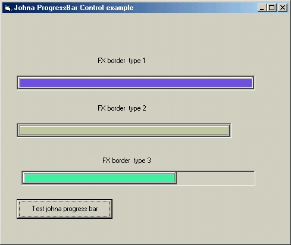



## johna  ProgressBAR ocx  \(1\.03 release\) with accepted negative values for Min/Max properties must see

### Description

This is a new version of my

Progress Bar ActiveX controle

i studied the feedbacks and add

good properties Color,Min/Max with negative value

accepted (ex: Min=-500,Max=500)

more than 8 FX presets for smoothing the progressBar

I'm waiting for your feedBacks or remarks
 
### More Info
 

             |
---                |---
**Submitted On**   |2001-10-24 23:32:32
**By**             |[polaris](https://github.com/Planet-Source-Code/PSCIndex/blob/master/ByAuthor/polaris.md)
**Level**          |Advanced
**User Rating**    |5.0 (25 globes from 5 users)
**Compatibility**  |VB 4\.0 \(32\-bit\), VB 5\.0, VB 6\.0
**Category**       |[Custom Controls/ Forms/  Menus](https://github.com/Planet-Source-Code/PSCIndex/blob/master/ByCategory/custom-controls-forms-menus__1-4.md)
**World**          |[Visual Basic](https://github.com/Planet-Source-Code/PSCIndex/blob/master/ByWorld/visual-basic.md)
**Archive File**   |[johna  Pro3071210232001\.zip](https://github.com/Planet-Source-Code/polaris-johna-progressbar-ocx-1-03-release-with-accepted-negative-values-for-min-max-prope__1-28134/archive/master.zip)

### API Declarations

A lot of APIz

